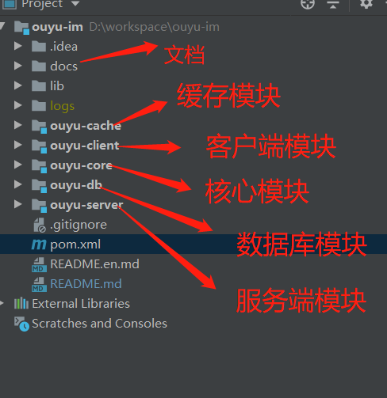
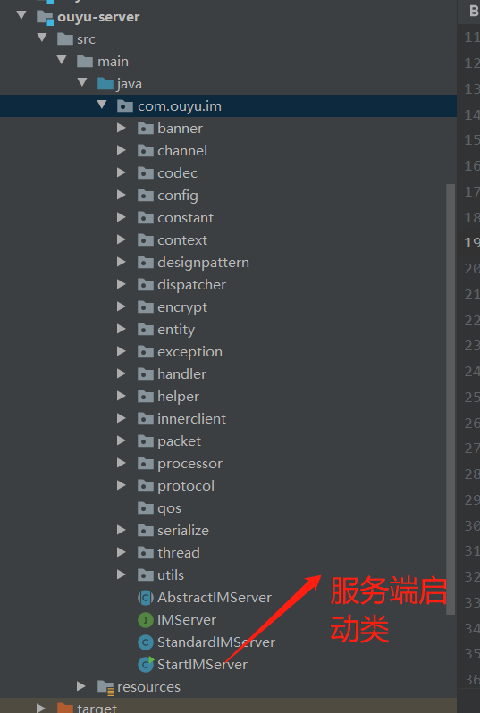
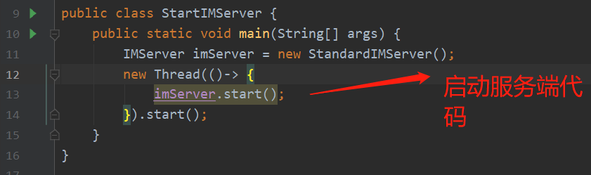
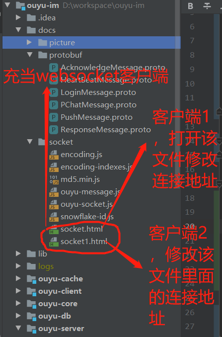

#### OUYU-IM简介
```
 (1)偶遇IM是一款基于netty的即时通讯框架，去中心化集群部署方案（简单解决脑裂问题）；
 (2)支持多协议传输（ws,wss,http,https）以及自定义协议，可自行扩展；
 (3)IM内置多种序列化方式如 jdk,json,hessian,hessian2,kryo,fst,thrift(暂未实现),protoStuff,protoBuf.并且客户端与服务端可以使用protoStuff和protoBuf进行相互转换；
 (4)支持文本消息，表情（emoji）,文件（图片/音视频/文档等）,语音（暂未开放）等功能；
 (5)内置db和cache做消息持久化(离线、历史)，高性能存储；
 (6)支持同一账号多设备在线（可控），消息漫游；
 (7)统一的编解码器，心跳检测，内置动态客户端；
 (8)多种算法数据加密；
 (9)SSL/TLS加密传输；
 (10)通过ack以及重试机制保证消息可靠，功能可扩展性很强；
 (11)tcp协议包packet                                                                                                             
    |    1    |   2     |      1    |   8      |   1      |    4     |     1    |     1    |     1    |     4    |     n   | 
    +--------+----------+-----------+----------+----------+----------+-----------+---------+----------+----------+---------+
    |        |          |           |          |          |          |           |         |          |          |         |
    |  魔数  |  协议类型 |   协议版本 | 协议包id |  设备类型 |   ip地址 |消息加密算法| 序列化算法| 消息类型 | 消息长度  | 消息体  |   
    |        |          |           |          |          |          |           |         |          |          |         |
    |        |          |           |          |          |          |           |         |          |          |         |
    +--------+----------+-----------+----------+----------+----------+-----------+---------+----------+----------+---------+

```
#### 软件架构
####   jdk1.8 + netty4.1.x
注意：如果不做特别说明,全部以大端序读写《https://www.cnblogs.com/iathanasy/p/12617793.html》

#### 安装教程
1.  项目目录



2.  服务端启动类



3.  服务端启动类代码



4.  websocket客户端简单测试



#### 使用说明

1.  首先修改服务端resources下的配置文件ouyu-im.properties中的集群服务地址im.server.cluster.address（如果开启集群）以及端口号im.server.port改为自己的服务地址以及端口号，不推荐使用127.0.0.1；如果单机启动则im.server.cluster.enable设置为false
2.  修改cache模块中配置信息，更改自己的连接地址
3.  在浏览器中打开文档中修改连接地址后的websocket客户端文件 
4.  测试两个客户端收发消息
5.  如果使用nginx代理请查看相关资料；

    https://my.oschina.net/leeck/blog/729443
    
    http://www.weixueyuan.net/a/790.html
    
    https://www.cnblogs.com/samits/articles/11807100.html

#### 联系方式
   个人QQ:664936598
   个人Email:664936598@qq.com
   qq群:664955628
   如果感觉对你有帮助请点个star支持一下
   
 


#### 下个版本
1. 支持SSL/TLS (已完成)
2. 支持弹幕消息推送（已完成）
3. 支持语音等（已完成）
4. 支持语音聊天、视频聊天(webRTC实现、或其他主流解决方案)
5. 支持白板功能
6. 集成springboot 以ouyu-im-spring-boot-starter
7. 完善缓存和db模块(已完成)
8. 优化代码（支持用户客户端自定义消息内容，可以方便对接第三方）

#### 最后说明
由于本人技术有限，项目中可能会有bug或不代码规范的地方，如果对你带来了困扰请跳过本项目。
并且如果有任何想说的欢迎私信或提issue，咱们一起共同探讨交流。
另外如果商用请告知，否则带来的一些后果自负。

#### 参与贡献


