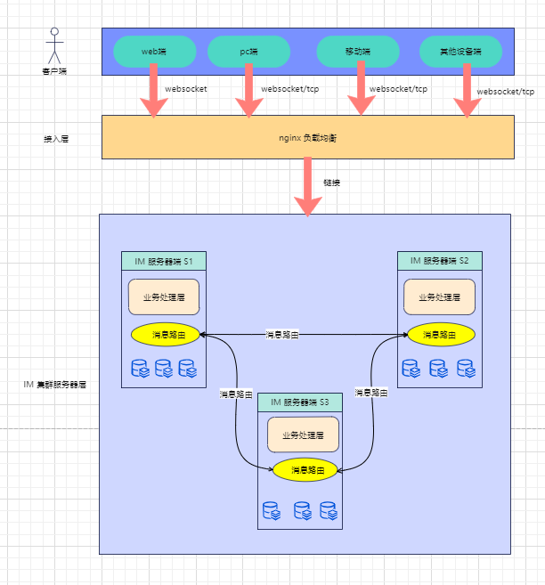

# OUYUNC-IM [](https://gitee.com/etxync/ouyunc-im)  
[](https://www.mit-license.org/)
<a href='https://gitee.com/etxync/ouyunc-im/stargazers'></img></a>
<a href='https://gitee.com/etxync/ouyunc-im/members'></img></a>
#### 偶云客-IM介绍 (免费！免费！免费！，代码注释极其丰富，请点个star:star:鼓励下)

```
 (1)偶云客IM是一款基于netty的即时通讯框架，去中心化集群部署方案（简单解决脑裂问题）；
 (2)支持多协议传输（ws,wss,http,https）以及自定义协议，可自行扩展；
 (3)IM内置多种序列化方式如 jdk,json,hessian,hessian2,kryo,fst,thrift(暂未实现),protoStuff,protoBuf.并且客户端与服务端可以使用protoStuff和protoBuf进行相互转换；
 (4)支持文本消息，表情（emoji）,文件（图片/音视频/文档等）,语音（暂未开放）等功能；
 (5)内置db和cache做消息持久化(离线、历史)，高性能存储；
 (6)支持同一账号多设备在线（可控），消息漫游；
 (7)统一的编解码器，心跳检测；
 (8)多种算法数据加密；
 (9)SSL/TLS加密传输；
 (10)通过ack以及重试机制保证消息可靠，功能可扩展性很强；
 (11)tcp协议包packet                                                                                                             
  

|    6    |     1   |    1    |     8    |    1     |    1      |    1     |     1    |     1     |     1     |      4    |    n     |
+---------+---------+---------+----------+----------+----------+-----------+----------+-----------+-----------+-----------+----------+-
|         |         |         |          |          |          |           |          |           |           |           |          |
|  魔数   |  协议类型| 协议版本 | 协议包id | 设备类型 | 网络类型  | 加密算法  | 序列化算法|  消息类型 | 保留字段   |  消息长度  |   消息体 |
|         |         |         |          |          |          |           |          |           |           |           |          |
+---------+---------+---------+----------+----------+----------+-----------+----------+-----------+-----------+-----------+----------+-

```

#### [官网地址](http://www.ouyunc.com) (暂未开放)
```
http://www.ouyunc.com
```

#### 软件架构

##### 开发环境：jdk21 + netty4.1.x

##### 软件架构图：



##### 代码目录结构：

|-- ouyunc-im
    |-- docs (文档)
    |-- ouyunc-client (java 客户端, 暂不可用)
    |-- ouyunc-commons (公共依赖模块)
    |   |-- ouyunc-ai (AI 模块)
    |   |-- ouyunc-base (基础模块, 存放常量,工具类等)
    |   |-- ouyunc-cache (缓存模块)
    |   |-- ouyunc-core (核心模块, 公共业务模块)
    |   |-- ouyunc-db (数据库工具类模块)
    |   |   |-- ouyunc-db-influx (influxdb 工具类支撑模块)
    |   |   |-- ouyunc-db-jdbc (jdbc 工具类支撑模块)
    |   |   |-- ouyunc-db-mongo (mongodb 工具类支撑模块)
    |   |-- ouyunc-domain (业务实体类)
    |   |-- ouyunc-mq (消息队列模块)
    |   |   |-- ouyunc-mq-kafka (kafka 工具类支撑模块)
    |   |   |-- ouyunc-mq-rocket (rocketmq 工具类支撑模块)
    |   |-- ouyunc-repository (业务持久化模块，这里负责业务数据持久化，调用工具类支撑来处理业务数据持久化)
    |-- ouyunc-message-spring-boot-starter (简单集成spring boot demo,可使用spring 扩展点自行扩展)
    |-- ouyunc-server (服务端)
        |-- src
        |   |-- main
        |       |-- java
        |       |   |-- com
        |       |       |-- ouyunc
        |       |           |-- message
        |       |               |-- AbstractMessageServer.java (服务端抽象类)
        |       |               |-- MessageServer.java (服务端接口)
        |       |               |-- StandardMessageServer.java (标准服务端实现类)
        |       |               |-- StartServer.java  (启动类)
        |       |               |-- banner (banner包,主要是打印banner)
        |       |               |   |-- MessageBanner.java (打印banner类)
        |       |               |-- channel (channel包,主要是处理channel)
        |       |               |   |-- DefaultServerChannelInitializer.java (默认server channel初始化器实现类)
        |       |               |   |-- DefaultSocketChannelInitializer.java (默认socket channel初始化器实现类)
        |       |               |   |-- ServerChannelInitializer.java (channel初始化器)
        |       |               |   |-- SocketChannelInitializer.java (socket channel初始化器)
        |       |               |-- cluster (集群包,主要是处理集群)
        |       |               |   |-- client (内置客户端连接池来实现集群间消息投递)
        |       |               |       |-- AbstractMessageClient.java (抽象的内置客户端实现类)
        |       |               |       |-- DefaultMessageClient.java (默认内置客户端实现类)
        |       |               |       |-- MessageClient.java (内置客户端接口)
        |       |               |       |-- handler (内置客户端连接池处理器包)
        |       |               |       |   |-- MessageClientChannelPoolHandler.java (内置客户端连接池处理器)
        |       |               |       |   |-- MessageClientHeartBeatHandler.java (内置客户端连接池连接心跳处理器)
        |       |               |       |-- pool (内置客户端连接池包)
        |       |               |           |-- MessageClientPool.java (内置客户端连接池)
        |       |               |-- context (上下文包,主要是处理上下文)
        |       |               |   |-- MessageServerContext.java (服务端上下文)
        |       |               |-- convert (转换包,主要是处理各个不同协议的数据转换)
        |       |               |   |-- BinaryWebSocketFramePacketConverter.java (二进制websocket协议 数据包转换器)
        |       |               |   |-- MqttMessagePacketConverter.java (mqtt 协议数据包转换器)
        |       |               |   |-- PacketConverter.java (数据包转换器接口)
        |       |               |   |-- PacketPacketConverter.java (packet 协议数据包转换器)
        |       |               |-- dispatcher (协议分发器包)
        |       |               |   |-- HAProxyProtocolDispatcherProcessor.java (HAProxy协议分发器处理器，主要处理在服务端代理的情况下获取真实客户端ip)
        |       |               |   |-- HttpProtocolDispatcherProcessor.java (http协议分发器处理器)
        |       |               |   |-- MqttProtocolDispatcherProcessor.java (mqtt协议分发器处理器)
        |       |               |   |-- MqttWebsocketProtocolDispatcherProcessor.java (mqtt websocket协议分发器处理器)
        |       |               |   |-- PacketProtocolDispatcherProcessor.java (packet协议分发器处理器)
        |       |               |   |-- ProtocolDispatcher.java (协议分发器入口)
        |       |               |   |-- ProtocolDispatcherProcessor.java (协议分发器处理器接口)
        |       |               |   |-- WebsocketProtocolDispatcherProcessor.java (websocket协议分发器处理器)
        |       |               |-- handler (handler处理器包)
        |       |               |   |-- ClusterPacketRouteHandler.java (集群消息路由处理器)
        |       |               |   |-- Convert2PacketHandler.java (转换为packet处理器)
        |       |               |   |-- EphemeralRemoteClientRealIpHandler.java (获取真实客户端ip处理器)
        |       |               |   |-- HeartBeatHandler.java (心跳处理器)
        |       |               |   |-- HttpProtocolDispatcherHandler.java (http协议分发器处理器)
        |       |               |   |-- LoginKeepAliveHandler.java (登录心跳保活处理器)
        |       |               |   |-- MessageLoggingHandler.java (消息日志处理器)
        |       |               |   |-- MonitorHandler.java (监控处理器)
        |       |               |   |-- MqttProtocolDispatcherHandler.java (mqtt协议分发器处理器)
        |       |               |   |-- PacketHandler.java  (packet处理器, 重要!!!)
        |       |               |   |-- PacketPostHandler.java (packet处理器后置处理器, 重要!!!)
        |       |               |   |-- PacketPreHandler.java (packet处理器前置处理器, 重要!!!)
        |       |               |   |-- PacketProtocolDispatcherHandler.java (packet协议分发器处理器)
        |       |               |-- helper (助手包)
        |       |               |   |-- ClientHelper.java (客户端助手，主要处理客户端登录绑定，是否在线等)
        |       |               |   |-- MessageHelper.java (消息助手,发送消息等)
        |       |               |-- listener (监听器包,可根据需要自行定义监听器和事件)
        |       |               |   |-- ClientLoginListener.java (客户端登录监听器)
        |       |               |   |-- ClientLogoutListener.java (客户端登出监听器)
        |       |               |   |-- SendFailListener.java (消息发送失败监听器)
        |       |               |   |-- ServerOfflineEventListener.java (服务器下线事件监听器)
        |       |               |   |-- ServerStartupEventListener.java (服务器启动事件监听器)
        |       |               |-- processor (业务处理器包, 做业务只需要关注这里, 重要!!!  重要!!!  重要!!!)
        |       |               |   |-- AbstractBaseProcessor.java (抽象基类处理器)
        |       |               |   |-- AbstractMessageProcessor.java (抽象消息处理器)
        |       |               |   |-- DelegatingMessageContentProcessorChain.java (消息内容处理器代理链)
        |       |               |   |-- DelegatingMessageProcessorChain.java (消息处理器代理链)
        |       |               |   |-- LoginMessageProcessor.java (登录消息处理器)
        |       |               |   |-- MqttConnectMessageContentProcessor.java (mqtt连接消息内容处理器)
        |       |               |   |-- MqttDisconnectMessageContentProcessor.java (mqtt断开连接消息内容处理器)
        |       |               |   |-- MqttMessageProcessor.java  (mqtt消息处理器)
        |       |               |   |-- MqttPingPongMessageContentProcessor.java (mqtt心跳消息内容处理器)
        |       |               |   |-- MqttPublishAckContentProcessor.java (mqtt发布确认消息内容处理器)
        |       |               |   |-- MqttPublishMessageContentProcessor.java (mqtt发布消息内容处理器)
        |       |               |   |-- MqttSubscribeMessageContentProcessor.java (mqtt订阅消息内容处理器)
        |       |               |   |-- MqttUnSubscribeMessageContentProcessor.java (mqtt取消订阅消息内容处理器)
        |       |               |   |-- PingPongMessageProcessor.java (外部客户端心跳消息处理器)
        |       |               |   |-- Processor.java (处理器接口)
        |       |               |   |-- ProcessorChain.java (处理器链接口)
        |       |               |   |-- ProcessorChainProxy.java (处理器链代理接口)
        |       |               |   |-- SynAckMessageProcessor.java (集群间syn-ack心跳同步确认消息处理器)
        |       |               |-- properties (属性配置包)
        |       |               |   |-- MessageServerProperties.java (服务器属性配置文件)
        |       |               |-- protocol (协议包)
        |       |               |   |-- NativePacketProtocol.java (packet协议实现类)
        |       |               |   |-- PacketProtocol.java (packet协议接口)
        |       |               |-- router (集群消息路由包)
        |       |               |   |-- AbstractMessageRouter.java (抽象路由)
        |       |               |   |-- BacktrackMessageRouter.java (递归回溯路由)
        |       |               |   |-- Router.java (路由接口)
        |       |               |-- thread (线程包)
        |       |               |   |-- LoginKeepAliveThread.java (登录心跳保活线程)
        |       |               |   |-- MessageClusterRouteFailureThread.java (集群消息路由失败处理线程)
        |       |               |   |-- MessageClusterSynAckThread.java (集群间syn-ack心跳同步确认线程)
        |       |               |-- validator (验证器包)
        |       |                   |-- AuthValidator.java (认证验证器)
        |       |                   |-- PermissionValidator.java (权限验证器)
        |       |                   |-- Validator.java (验证器接口)
        |       |-- resources (资源包)
        |           |-- log4j2.xml (log4j2 日志配置文件)
        |           |-- ouyunc-server.yml (服务器配置文件)


#### 演示地址 
- web端pc demo 演示地址 （服务器过期）：
```
略
```
- 移动端H5 demo 演示地址 （服务器过期）：
```
https://m.ouyunc.com
测试账号及密码（也可以自己注册）：111/1, 222/1, 333/1
```
- 移动端Android demo 演示地址 [点击下载apk](https://gitee.com/etxync/ouyunc-im/raw/4.0.0/docs/picture/ouyunc-im-android-apk-4.0.0.png)或扫描下方二维码下载安装：


- 移动端IOS demo 演示地址：
```
略
```
#### 演示示例
- web PC端演示示例 [:point_down:点击下载](https://gitee.com/etxync/ouyunc-im/raw/v3.0.2/docs/picture/%E5%81%B6%E4%BA%91%E5%AE%A2web%E5%AE%A2%E6%88%B7%E7%AB%AF%E6%BC%94%E7%A4%BA.mp4)

<video width="320" height="240" controls>
  <source src="https://gitee.com/etxync/ouyunc-im/raw/v3.0.2/docs/picture/%E5%81%B6%E4%BA%91%E5%AE%A2web%E5%AE%A2%E6%88%B7%E7%AB%AF%E6%BC%94%E7%A4%BA.mp4">
</video>

- 移动端示例截图


 **注意** ：如果不做特别说明,全部以大端序读写《https://www.cnblogs.com/iathanasy/p/12617793.html》


#### 相关demo源码地址
| 项目名称            | 项目地址                                      | 项目说明       |
|-----------------|-------------------------------------------|------------|
| ouyunc-app      | https://ext.dcloud.net.cn/plugin?id=15255 | uniapp前端地址 |


#### [快速开始](https://gitee.com/etxync/ouyunc-im/wikis/OUYUNC-IM%20v3.x/%E5%BF%AB%E9%80%9F%E5%BC%80%E5%A7%8B?sort_id=7020530)

```
https://gitee.com/etxync/ouyunc-im/wikis/%E5%81%B6%E4%BA%91%E5%AE%A2-IM%20v3.x/%E5%BF%AB%E9%80%9F%E5%BC%80%E5%A7%8B
```
#### [SDK接入指南](https://gitee.com/etxync/ouyunc-im/wikis/OUYUNC-IM%20v3.x/%E5%AE%A2%E6%88%B7%E7%AB%AFsdk%E4%BD%BF%E7%94%A8%E6%96%87%E6%A1%A3)

```
https://gitee.com/etxync/ouyunc-im/wikis/OUYUNC-IM%20v3.x/%E5%AE%A2%E6%88%B7%E7%AB%AFsdk%E4%BD%BF%E7%94%A8%E6%96%87%E6%A1%A3
```
#### [打包部署](https://gitee.com/etxync/ouyunc-im/wikis/%E5%81%B6%E4%BA%91%E5%AE%A2-IM%20v3.x/%E5%AE%89%E8%A3%85%E9%83%A8%E7%BD%B2)
 
```
 https://gitee.com/etxync/ouyunc-im/wikis/%E5%81%B6%E4%BA%91%E5%AE%A2-IM%20v3.x/%E5%AE%89%E8%A3%85%E9%83%A8%E7%BD%B2
 ```

#### 联系方式

   qq群:664955628 <a target="_blank" href="https://qm.qq.com/cgi-bin/qm/qr?k=FFFe8sCs4e11KOD89XK6vVrK14NCBb5x&jump_from=webapi&authKey=Y1JeElm7/HUi4cESA9FJgyl51JhCwQ2bDv1uOydLvMvo25+cqe93GUMxPEyB8xND"></a>  (打广告太多，加群请附加信息)

   注意：IM涉及到的视频会议由于服务器配置低以及带宽（2M）较小，会出现卡顿延迟现象

   如果感觉对你有帮助请点个star支持一下，感谢！

 
#### 下个版本
1. 支持客服相关业务（已完成）
2. 支持弹幕相关业务（已完成）
3. 支持语音等（已完成）
4. 支持语音聊天、视频聊天（已完成）
5. 在线简单视频会议（已完成）
6. 支持白板功能（已完成）
7. 集成springboot 以ouyunc-im-spring-boot-starter （已完成）
8. 打成依赖包放到中央仓库，作为依赖组件来引用
9. 重构qos消息可靠性到达（已完成）
10. 优化数据库模块，支持分表分库
11. 优化其他代码


#### 版本升级

#####  **3.0.1 ~ 3.0.2** 
1. 优化分布式锁粒度
2. 去掉集群中服务下线的处理（在当前业务中目前用不到，不必考虑）
3. 优化其他代码

#####  **3.1.1 ~ 4.0.0**
1. 去除离线消息处理
2. 增加公共的集群路由逻辑
3. 添加好友或群邀请，自动应答策略
4. 去除hutool ,使用fastJson以及其他工具类来替代hutool
5. 修改登录缓存存储结构为hash, key（登录用户id）， hashKey(登录设备号)  value(登录信息 LoginUserInfo)
6. 增加登录设备类型
7. js-SDK 修改TextEncode 以及雪花算法 bigInt其他浏览器不支持问题
8. 增加平台校验，支持对不同平台作出最大连接数限制
9. 优化其他代码

#####  **4.0.0 ~ 4.0.1**
1. 添加日志全局链路跟踪
2. 优化其他代码

#####  **4.0.1 ~ 4.0.2**
1. 添加命令行参数解析
2. 优化其他代码

#####  **4.0.2 ~ 4.0.3**
1. 解决集群环境下跨服务投递消息时找不到群成员问题
2. 优化其他代码

#####  **4.0.3 ~ 4.1.0**
1. 增加聊天托管功能
2. 增加机器人客服（人工客服），可根据一定的策略或接入chatgpt进行对话，可根据自己的业务扩展处理逻辑
3. 优化其他代码

#####  **4.1.0 ~ 4.2.0**
1. 增加消息撤回处理器
2. 增加消息监控预处理（后续扩展）
3. 优化其他代码

#####  **4.2.0 ~ 5.0.0**
1. 增加多租户
2. 增加mqtt协议处理
3. 添加群聊和私聊会话消息
4. 对离线消息的存储格式进行重构
5. 优化其他代码

#####  **5.0.0 ~ 6.0.0**
1. 适配jdk21,重构项目为框架，增加扩展点
2. 优化其他代码

#####  **6.0.0 ~ 6.1.0**
1. 添加业务操作工具类
2. 优化其他代码

#### 最后说明
由于本人技术有限，项目中可能会有bug或代码不规范的地方，如果对你带来了困扰请跳过本项目。
并且如果有任何想说的欢迎私信或提issue，咱们一起共同探讨交流。
最近事情比较多，版本迭代更新缓慢，正在筹备升级到jdk21 ，通过插件的方式添加各种协议处理器，优化代码，敬请期待

#### 参与贡献


#### 常见问题
