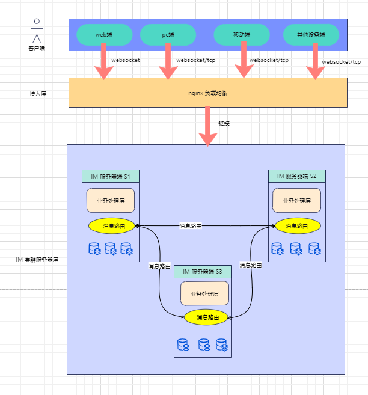
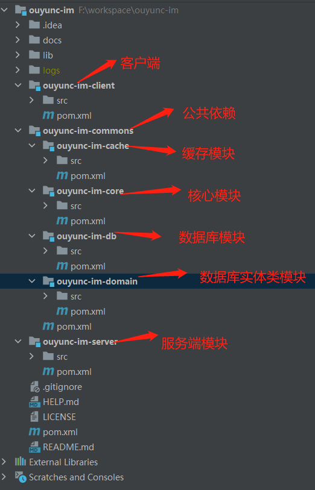

# OUYUNC-IM [](https://gitee.com/etxync/ouyunc-im)  
[](https://www.mit-license.org/)
<a href='https://gitee.com/etxync/ouyunc-im/stargazers'></img></a>
<a href='https://gitee.com/etxync/ouyunc-im/members'></img></a>
#### 偶云客-IM介绍 (免费！免费！免费！，代码注释极其丰富，请点个star:star:鼓励下)

```
 (1)偶云客IM是一款基于netty的即时通讯框架，去中心化集群部署方案（简单解决脑裂问题）；
 (2)支持多协议传输（ws,wss,http,https）以及自定义协议，可自行扩展；
 (3)IM内置多种序列化方式如 jdk,json,hessian,hessian2,kryo,fst,thrift(暂未实现),protoStuff,protoBuf.并且客户端与服务端可以使用protoStuff和protoBuf进行相互转换；
 (4)支持文本消息，表情（emoji）,文件（图片/音视频/文档等）,语音（暂未开放）等功能；
 (5)内置db和cache做消息持久化(离线、历史)，高性能存储；
 (6)支持同一账号多设备在线（可控），消息漫游；
 (7)统一的编解码器，心跳检测；
 (8)多种算法数据加密；
 (9)SSL/TLS加密传输；
 (10)通过ack以及重试机制保证消息可靠，功能可扩展性很强；
 (11)tcp协议包packet                                                                                                             
  
|    1    |     1   |    1    |     8    |    1     |    1     |     4     |    1     |     1     |     1     |    4     |      n    |
+---------+---------+---------+----------+----------+----------+-----------+----------+-----------+-----------+----------+-----------+
|         |         |         |          |          |          |           |          |           |           |          |           |
|  魔数   |  协议类型| 协议版本 | 协议包id | 设备类型 | 网络类型  |  IP地址   | 加密算法 | 序列化算法 |  消息类型  | 消息长度 |  消息体    |
|         |         |         |          |          |          |           |          |           |           |          |           |
+---------+---------+---------+----------+----------+----------+-----------+----------+-----------+-----------+----------+-----------+


```

#### [官网地址](http://www.ouyunc.com) (暂未开放)
```
http://www.ouyunc.com
```

#### 软件架构

##### 开发环境：jdk1.8 + netty4.1.x

##### 软件架构图：



##### 代码目录结构：




#### 演示地址 
- web端pc demo 演示地址：
```
略
```
- 移动端H5 demo 演示地址：
```
https://m.ouyunc.com
测试账号及密码（也可以自己注册）：111/1, 222/1, 333/1
```
- 移动端Android demo 演示地址 [点击下载apk](https://gitee.com/etxync/ouyunc-im/raw/4.0.0/docs/picture/ouyunc-im-android-apk-4.0.0.png)或扫描下方二维码下载安装：


- 移动端IOS demo 演示地址：
```
略
```
#### 演示示例
- web PC端演示示例 [:point_down:点击下载](https://gitee.com/etxync/ouyunc-im/raw/v3.0.2/docs/picture/%E5%81%B6%E4%BA%91%E5%AE%A2web%E5%AE%A2%E6%88%B7%E7%AB%AF%E6%BC%94%E7%A4%BA.mp4)

<video width="320" height="240" controls>
  <source src="https://gitee.com/etxync/ouyunc-im/raw/v3.0.2/docs/picture/%E5%81%B6%E4%BA%91%E5%AE%A2web%E5%AE%A2%E6%88%B7%E7%AB%AF%E6%BC%94%E7%A4%BA.mp4">
</video>

- 移动端示例截图


 **注意** ：如果不做特别说明,全部以大端序读写《https://www.cnblogs.com/iathanasy/p/12617793.html》


#### [快速开始](https://gitee.com/etxync/ouyunc-im/wikis/OUYUNC-IM%20v3.x/%E5%BF%AB%E9%80%9F%E5%BC%80%E5%A7%8B?sort_id=7020530)

```
https://gitee.com/etxync/ouyunc-im/wikis/%E5%81%B6%E4%BA%91%E5%AE%A2-IM%20v3.x/%E5%BF%AB%E9%80%9F%E5%BC%80%E5%A7%8B
```
#### [SDK接入指南](https://gitee.com/etxync/ouyunc-im/wikis/OUYUNC-IM%20v3.x/%E5%AE%A2%E6%88%B7%E7%AB%AFsdk%E4%BD%BF%E7%94%A8%E6%96%87%E6%A1%A3)

```
https://gitee.com/etxync/ouyunc-im/wikis/OUYUNC-IM%20v3.x/%E5%AE%A2%E6%88%B7%E7%AB%AFsdk%E4%BD%BF%E7%94%A8%E6%96%87%E6%A1%A3
```
#### [打包部署](https://gitee.com/etxync/ouyunc-im/wikis/%E5%81%B6%E4%BA%91%E5%AE%A2-IM%20v3.x/%E5%AE%89%E8%A3%85%E9%83%A8%E7%BD%B2)
 
```
 https://gitee.com/etxync/ouyunc-im/wikis/%E5%81%B6%E4%BA%91%E5%AE%A2-IM%20v3.x/%E5%AE%89%E8%A3%85%E9%83%A8%E7%BD%B2
 ```

#### 联系方式

   qq群:664955628 <a target="_blank" href="https://qm.qq.com/cgi-bin/qm/qr?k=FFFe8sCs4e11KOD89XK6vVrK14NCBb5x&jump_from=webapi&authKey=Y1JeElm7/HUi4cESA9FJgyl51JhCwQ2bDv1uOydLvMvo25+cqe93GUMxPEyB8xND"></a>  (打广告太多，加群请附加信息)

   注意：IM涉及到的视频会议由于服务器配置低以及带宽（2M）较小，会出现卡顿延迟现象

   如果感觉对你有帮助请点个star支持一下，感谢！

 
#### 下个版本
1. 支持客服相关业务（已完成）
2. 支持弹幕相关业务（已完成）
3. 支持语音等（已完成）
4. 支持语音聊天、视频聊天（已完成）
5. 在线简单视频会议（已完成）
6. 支持白板功能（已完成）
7. 集成springboot 以ouyunc-im-spring-boot-starter
8. 打成依赖包放到中央仓库，作为依赖组件来引用
9. 重构qos消息可靠性到达（已完成）
10. 优化数据库模块，支持分表分库
11. 添加es来处理搜索消息
12. 优化其他代码


#### 最后说明
由于本人技术有限，项目中可能会有bug或代码不规范的地方，如果对你带来了困扰请跳过本项目。
并且如果有任何想说的欢迎私信或提issue，咱们一起共同探讨交流。

#### 版本升级

#####  **3.0.1 ~ 3.0.2** 
1. 优化分布式锁粒度
2. 去掉集群中服务下线的处理（在当前业务中目前用不到，不必考虑）
3. 优化其他代码

#####  **3.1.1 ~ 4.0.0**
1. 去除离线消息处理
2. 增加公共的集群路由逻辑
3. 添加好友或群邀请，自动应答策略
4. 去除hutool ,使用fastJson以及其他工具类来替代hutool
5. 修改登录缓存存储结构为hash, key（登录用户id）， hashKey(登录设备号)  value(登录信息 LoginUserInfo)
6. 增加登录设备类型
7. js-SDK 修改TextEncode 以及雪花算法 bigInt其他浏览器不支持问题
8. 增加平台校验，支持对不同平台作出最大连接数限制
9. 优化其他代码

#####  **4.0.0 ~ 4.0.1**
1. 添加日志全局链路跟踪
2. 优化其他代码

#####  **4.0.1 ~ 4.0.2**
1. 添加命令行参数解析
2. 优化其他代码

#### 参与贡献


#### 常见问题
