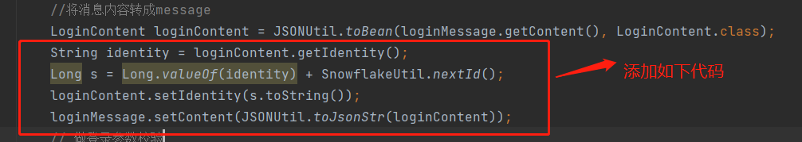

### 注意：压测之前请先修改登录的部分片段代码，目的是为了模拟真实环境。
代码片段修改如下：
```
    String identity = loginContent.getIdentity();
    Long s = Long.valueOf(identity) + SnowflakeUtil.nextId();
    loginContent.setIdentity(s.toString());
    loginMessage.setContent(JSONUtil.toJsonStr(loginContent));
```


